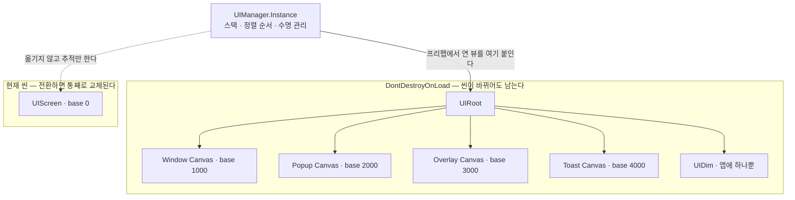
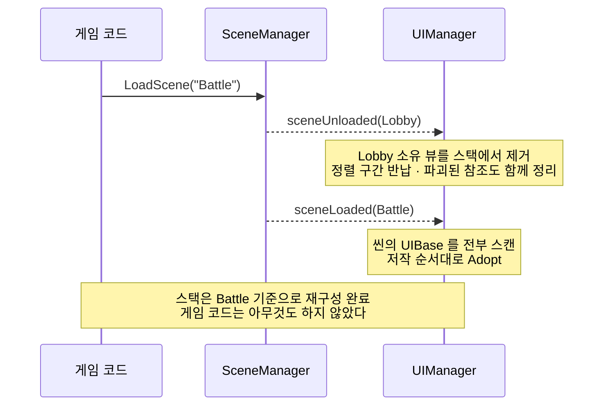

# Unity UI Stack System

Unity 6 (uGUI) 용 UI 스택 관리 시스템.
레이어 캔버스 · 정렬 순서 자동 배정 · 씬 소유권 기반 수명 관리를 한 덩어리로 묶어,
게임 코드가 `UIManager.Instance.OpenAsync<T>()` 한 줄만 알면 되도록 만든 런타임이다.

- **Unity** 6000.3.9f1 / **렌더 파이프라인** URP 17.3 / **입력** Input System 1.18
- **어셈블리** `UISystem.Runtime` (`Assets/UISystem/Runtime/UISystem.Runtime.asmdef`)
- **네임스페이스** `UISystem`

---

## 이 저장소의 단계

**UI 시스템의 기초**를 세우는 단계다.
스택 관리, 레이어 분리, 정렬 순서 배정, 씬 전환에 걸친 수명 관리 — 여기까지의 뼈대를 잡았다.

연출, 화면 전환 애니메이션, 데이터 바인딩, Addressables 연동은 아직 들어 있지 않다.
실제로 굴려 보며 문제가 드러나는 대로 하나씩 개선해 나갈 계획이고, 그래서 지금 구조는
**바뀔 것을 전제로 갈아 끼울 자리를 인터페이스로 뚫어 둔 상태**다.

---

## 전체 구조



`UIManager` 는 앱에 하나이고 씬보다 오래 산다.
레이어 캔버스와 Dim 은 영속 루트에 있고, `UIScreen` 만 씬에 남는다.
이 비대칭이 아래 모든 설명의 출발점이다.

---

## 동작 방식

### 1. 레이어와 뷰 타입

레이어는 `UILayerSettings` 에서 정의하고, **뷰 타입이 자기 레이어를 고정한다.**
`sealed override` 라 프리팹마다 레이어를 잘못 찍는 사고가 구조적으로 불가능하다.
인스턴스마다 갈리는 값은 `UIViewOptions` 의 `BlockClose`, `Pooled` 둘뿐이다.

| 타입 | 레이어 | Dim | 아래 가림 | 용도 |
| --- | --- | --- | --- | --- |
| `UIScreen` | Screen (0) | ✗ | ✗ | 씬의 주 화면. 로비, 전투 HUD |
| `UIWindow` | Window (1) | ✗ | **✓** | 전체 화면 콘텐츠. 인벤토리, 상점 |
| `UIPopup` | Popup (2) | **✓** | ✗ | 모달. 확인창, 결과창 |
| `UIOverlay` | Overlay (3) | **✓** | ✗ | 시스템 층. 로딩, 튜토리얼 마스크 |
| `UIToast` | Toast (4) | ✗ | ✗ | 최상단 알림. 입력을 통과시킨다 |
| `UIElement` | — | — | — | 스택에 참여하지 않는 부품(슬롯, 게이지) |

`UIScreen` 만 특별하다. **UIRoot 로 옮기지 않고 씬에 놓인 채로 추적만 한다.**
옮기면 루트 캔버스가 서브캔버스로 강등되면서 드리븐 RectTransform 이 풀리고 자기 `CanvasScaler` 가 죽는다.
씬 뷰에서 저작한 모습이 그대로 실행되게 하려면 씬에 두는 수밖에 없다.

### 2. 정렬 순서는 손으로 매기지 않는다

레이어마다 `BaseSortingOrder` 에서 시작하는 커서를 하나 두고,
뷰가 가진 캔버스 수(+ Dim 이 필요하면 한 칸)만큼 **연속 구간을 예약**한다.

```
레이어별 구간                    ConfirmPopup(캔버스 1개 + Dim)이 열릴 때

Toast    4000 ─┬─ 4999             Popup 커서 2000 에서 2칸 예약
Overlay  3000 ─┤                   ┌──────────────────────────────┐
Popup    2000 ─┤  ← 커서 여기        │ 2001  뷰 캔버스              │
Window   1000 ─┤                   │ 2000  Dim 자리 (예약만 해둠)  │
Screen      0 ─┴─  999             └──────────────────────────────┘
                                   커서는 2002 로 전진
```

반납된 구간은 커서 바로 아래에 닿는 순간 연쇄적으로 회수된다.
중간이 먼저 닫히면 구멍이 남지만, 그 위가 닫힐 때 함께 걷힌다 —
구멍이 있어도 정렬 정확성에는 영향이 없고, 낭비되는 것은 레이어 용량뿐이다.

### 3. 스택 관리

열린 UI 는 전부 **하나의 평평한 스택**에 (레이어, 정렬 순서) 오름차순으로 들어간다.
씬에 배치된 것이든 프리팹에서 태어난 것이든 같은 줄에 선다.

```
_stack (아래 → 위)                sortingOrder   Canvas   비고

  [4] SystemToast   (Toast)          4000          ✓     입력 통과
  [3] ConfirmPopup  (Popup)          2001          ✓     ← Dim 소유
       └ UIDim                       2000          ✓     여기서 입력이 막힌다
  [2] ShopWindow    (Window)         1000          ✓     아래를 끈다
  [1] LobbyScreen   (Screen, 씬)        0          ✗     Canvas 꺼짐
```

UI 가 열리거나 닫힐 때마다 스택을 **위에서부터** 훑으며 가림 상태를 다시 계산한다.

- `HideBelow`(Window) 아래는 **캔버스를 끈다** — 그리지도 않는다.
- `UseDim`(Popup/Overlay) 아래는 **켜둔 채 `OnCoveredChanged(true)` 로만 통지**한다.
  보이지만 갱신할 필요는 없는 상태를 뷰가 알 수 있다.
- Dim 은 보이는 것 중 **최상단 모달 하나에만** 붙는다.
  인스턴스가 앱에 하나뿐이라 반투명이 겹쳐 짙어지는 일이 구조적으로 생기지 않는다.

뒤로가기도 이 스택을 그대로 쓴다. 위에서부터 닫을 수 있는 것을 찾아 하나 닫고,
닫히면 안 되는 모달(`BlockClose` + Dim)을 만나면 거기서 소비하고 아래로 전파하지 않는다.

### 4. 씬 전환과 소유권

영속 매니저가 씬의 UI 를 붙잡고 있으면 누수가 된다.
그래서 **뷰마다 소유 씬을 기록**하고, `SceneManager` 이벤트 두 개로 전부 정리한다.



- **`sceneLoaded`** — 그 씬에 배치된 `UIBase` 를 찾아 자동으로 스택에 편입한다.
  씬마다 등록용 컴포넌트를 따로 붙일 필요가 없다. 잊고 안 붙여서 조용히 깨지는 일도 없다.
- **`sceneUnloaded`** — 그 씬이 소유하던 뷰를 스택에서 빼고 정렬 구간을 반납한다.
  영속 매니저의 **유일한 누수 방어선**이다.

씬에 배치되어 입양된 뷰는 닫아도 파괴하거나 풀에 넣지 않고 비활성화만 한다.
프리팹에서 태어난 뷰는 `Options.Pooled` 면 타입별 풀로, 아니면 파괴된다.

### 5. 어느 씬에서 실행해도 똑같이 동작한다

이 시스템의 실사용 강점이다. **부트스트랩 씬을 강제하지 않는다.**
작업하던 씬에서 Play 를 눌러도 영속 영역이 서고, `UIManager.Instance` 가 항상 같은 상태로 준비된다.
"초기화 씬부터 돌려야 UI 가 뜬다"는 제약이 없어서 이터레이션이 끊기지 않는다.

```
SubsystemRegistration  ─→  Instance 되돌리기 (도메인 리로드를 꺼도 안전하게)
BeforeSceneLoad        ─→  UIBootstrap.Create()  →  UIManager.Instance
───────────────────────────────────────────────────────────────────────
첫 씬의 Awake                 ← 여기서부터 Instance 는 항상 준비되어 있다
```

`UIBootstrap` 은 `Resources/UIBootstrap.asset` 을 읽어 UIRoot 를 `DontDestroyOnLoad` 로 올리고
`UIManager` 를 조립한 뒤 물러난다. 조립 전담이라 `internal` 이고, 게임 코드에는 보이지 않는다.
조립은 이 훅 한 곳에서만 일어나며, 실패하면 사유가 로그로 남고 `Instance` 는 `null` 로 남는다.

그 대가로 `UIManager` 의 정적 멤버는 `Instance` 하나뿐이고 나머지는 전부 생성자 주입이다.
그래서 테스트에서 `new UIManager(fakes)` 가 되고, DI 컨테이너를 쓰는 프로젝트는
`UIBootstrap` 을 버리고 컨테이너에 등록만 하면 된다.

> `BeforeSceneLoad` 훅끼리의 순서는 Unity 가 보장하지 않는다.
> 다른 초기화 훅에서 UI 를 건드려야 한다면 `AfterSceneLoad` 로 미루는 편이 안전하다.

---

## 폴더 구조

```
Assets/UISystem/Runtime/
├─ Core/
│  ├─ UIBootstrap.cs           # (internal) 조립 전담. 어느 씬에서 Play 해도 영속 영역을 세운다
│  ├─ UIBootstrapSettings.cs   # RootPrefab / Layers / PrefabProvider 참조
│  ├─ UIManager.cs             # 스택, 열기/닫기, 가림 계산, 씬 훅, 풀링. 접근점 UIManager.Instance
│  ├─ SortingOrderAllocator.cs # 레이어별 정렬 구간 예약/반납
│  ├─ UILayerSettings.cs       # 레이어 정의 + 공통 스케일 설정
│  ├─ UIRoot.cs / UIRootProvider.cs
│  ├─ UIPrefabTable.cs         # 기본 프리팹 공급원 (타입 ↔ 프리팹 직접 참조)
│  ├─ IUIPrefabProvider.cs / IUIRootProvider.cs
│  └─ UITypes.cs               # UILayerId, UIViewOptions, UICloseReason, UIResult
└─ Views/
   ├─ UIBase.cs                # 스택에 참여하는 모든 UI의 베이스
   ├─ UIScreen / UIWindow / UIPopup / UIOverlay / UIToast / UIElement
   └─ UIDim.cs                 # 공유 반투명 판
```

---

## 설정

라이브러리가 뜨려면 에셋 네 가지가 있어야 한다. 프로젝트당 한 번만 만들면 된다.

1. **레이어 설정** — `Create ▸ UI System ▸ UI Layer Settings`
   기본값이 `Screen / Window / Popup / Overlay / Toast` 다섯 개로 채워져 있다.
   배열 순서가 `UILayerId` 의 인덱스(0~4)와 **반드시 일치해야 한다.**
2. **프리팹 표** — `Create ▸ UI System ▸ UI Prefab Table`
   `TypeName` 에 뷰 타입의 `FullName`(예: `Game.UI.ConfirmPopup`), `Prefab` 에 해당 프리팹을 넣는다.
3. **UIRoot 프리팹**
   - 빈 GameObject 에 `RectTransform` + `UIRoot` + `UIRootProvider` 를 붙인다.
   - `UIRootProvider._settings` 에 1번을, `_container` 에 자기 `RectTransform` 을 꽂는다.
   - 자식으로 `Canvas` + `GraphicRaycaster` + `Image`(반투명) + `UIDim` 오브젝트를 하나 만들어 `UIRoot._dim` 에 연결한다.
   - **UIRoot 자체에는 Canvas 를 붙이지 않는다.** 레이어 캔버스는 `UIRootProvider` 가 실행 시 만든다.
4. **부팅 설정** — `Create ▸ UI System ▸ UI Bootstrap Settings`
   **반드시 `Assets/Resources/UIBootstrap.asset`** 으로 저장하고 3·1·2번을 각각 꽂는다.
   (Addressables 가 준비되기 전에 읽혀야 해서 `Resources` 에 둔다.)

---

## 사용법

접근점은 `UIManager.Instance` 하나다.

### 열기

```csharp
// 프리팹 표에서 태어나 Popup 레이어에 붙는다
var popup = await UIManager.Instance.OpenAsync<ConfirmPopup>();
```

### 결과를 기다리기

```csharp
var popup = await UIManager.Instance.OpenAsync<ConfirmPopup>();
var result = await popup.WaitForCloseAsync();

if (result.IsConfirmed)
    Purchase();
```

`UICloseReason` 은 넷이다 — `Confirmed` / `Cancelled` / `Dismissed`(Dim 클릭·뒤로가기) / `ClosedByService`(CloseAll·씬 전환).

### 닫기

```csharp
popup.Close(UICloseReason.Confirmed);      // 뷰가 스스로
await manager.CloseAsync(popup);           // 서비스가
await manager.CloseAllAsync<UIPopup>();    // 타입 단위로
await manager.CloseAllAsync();             // 전부
```

### 뒤로가기

```csharp
// 최상단부터 닫을 수 있는 것을 찾아 하나 닫는다.
// 못 닫는 모달(BlockClose + Dim)을 만나면 거기서 소비하고 아래로 전파하지 않는다.
if (!UIManager.Instance.OnBackPressed())
    ShowQuitConfirm();
```

### 조회

```csharp
manager.IsOpen<InventoryWindow>();
manager.Find<InventoryWindow>();
manager.TryGetTop(out var top);
manager.OpenCount;
```

### 뷰 만들기

```csharp
public sealed class ConfirmPopup : UIPopup
{
    [SerializeField] private Button _ok;
    [SerializeField] private Button _cancel;

    protected override void OnOpened()
    {
        _ok.onClick.AddListener(() => Close(UICloseReason.Confirmed));
        _cancel.onClick.AddListener(() => Close(UICloseReason.Cancelled));
    }

    protected override void OnClosing(UIResult result) { }

    // 위에 다른 UI가 덮이거나 걷혔을 때. 가려진 동안 갱신을 멈추는 용도.
    protected override void OnCoveredChanged(bool covered) { }

    // 연출. null 을 반환하면 즉시 진행한다.
    protected override Awaitable PlayOpenAsync(CancellationToken token) => FadeInAsync(token);
}
```

프리팹은 `UIPrefabTable` 에 `타입 FullName ↔ 프리팹` 으로 등록한다. 경로 문자열도, 리플렉션 조회도 쓰지 않는다.

---

## 확장 포인트

바뀔 것을 전제로 뚫어 둔 자리들이다.

| 갈아 끼울 것 | 방법 |
| --- | --- |
| 프리팹 로딩 (Addressables / 번들) | `IUIPrefabProvider` 를 구현한 `ScriptableObject` 를 만들어 `UIBootstrapSettings.PrefabProvider` 에 꽂는다. Addressables 구현은 `ReleaseAll()` 에서 반드시 핸들을 놓아야 한다 |
| 레이어 구성 | `UILayerSettings` 에서 이름·`BaseSortingOrder`·용량·캔버스 생성 여부를 정의한다 |
| 루트 배치 | `IUIRootProvider` 를 직접 구현한다 |
| 연출 | 뷰에서 `PlayOpenAsync` / `PlayCloseAsync` 를 재정의한다 |
| 조립 방식 | `UIManager` 는 생성자 주입만 쓴다. DI 컨테이너에 직접 등록해도 된다 |

---

## 규약

- `UIScreen` 은 **씬마다 하나**다. 겹친 씬이 각자 Screen 을 들고 오면 경고가 뜬다 — 그런 화면은 `UIWindow` 가 맞다.
- 씬의 `UIScreen` 은 루트 캔버스이므로 `CanvasScaler` 를 **직접 갖고**, 그 값이 `UILayerSettings` 와 같아야 한다.
- `UIRoot` 아래로 들어가는 뷰 프리팹은 **서브캔버스**다. `CanvasScaler` 를 붙이면 안 된다.
- `UIToast` 프리팹에는 `GraphicRaycaster` 를 붙이지 않는다. 레이캐스트 대상에서 빠져야 입력이 통과한다.
- `UseDim` 인 뷰를 쓰려면 UIRoot 프리팹에 `UIDim` 이 있어야 한다. 없으면 뒤쪽 입력이 그대로 통과하므로 에러로 다룬다.
- 런타임에 뷰 하위로 캔버스를 추가하지 않는다. 캔버스 목록은 열리는 시점에 고정된다.
